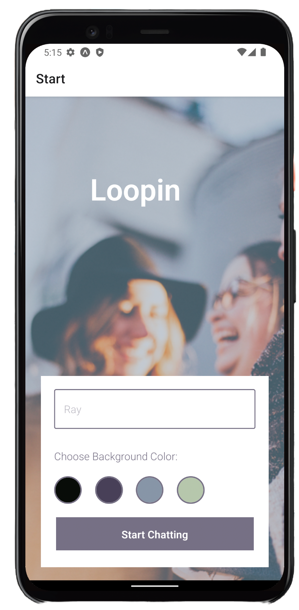
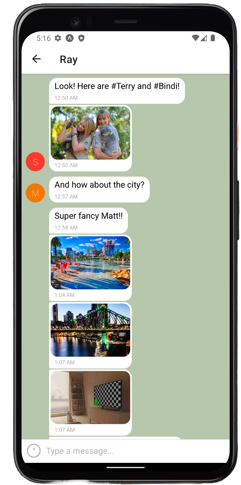
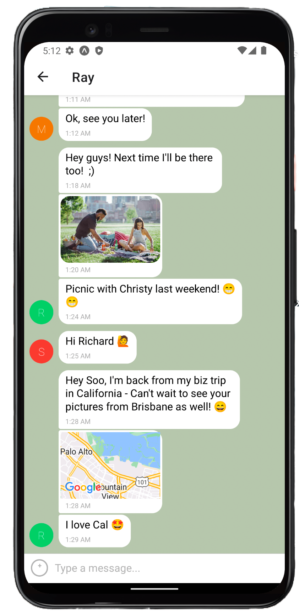

# 📲 Chat App
Is a messenger app for mobile devices using React Native. The app provides users with a chat interface and options to share images and their location. Users can share self-taken photos with other users, upload photos from their photo gallery and communicate their location via Google Maps.

<br>





## Application features:
- A page where users can enter their name and choose a background color for the chat screen before joining the chat.
- A page displaying the conversation, as well as an input field and submit button.
- The chat provides users with two additional communication features: sending images and location data.
- Data gets stored online and offline.

## Technology used:
- React Native
- Expo
- Google Firestore Database
- Google Firebase Authentication
- React Native Gifted Chat

<br>

## How to use it:

### Prerequisites

<br>

Install nodejs LTS version.
Setting up your database
- Sign in at Google Firebase
- Create a new project in test mode
- In there create a Firestore Database
- At *Settings* -> *General* -> *Your apps* -> *Firestore for Web* generate your configuration object.

<br>

## Installation

<br>

Cloning the repository:

<br>

````
git clone https://github.com/koola123/chat.git
cd chat
`````

In the App.js file replace the firebaseConfig variable with the configuration info from your own Firestore database:

then run the following commands:
````
firebase.initializeApp({
  apiKey: "your-api-key",
  authDomain: "your-authdomain",
  projectId: "your-project-id",
  storageBucket: "your-storage-bucket",
  messagingSenderId: "your-messaging-sender-id",
  appId: "your-app-id",
});
````

Run the following next commands:
````
npx expo install
npx expo start
````
Install the Expo Go App from <b>Apple Store</b> or <b>Google Play Store</b> to test the project on your mobile device.

<br>

Finally:

1. Install the Expo Go App from Apple Store or Google Play Store to test the project on your mobile device.
2. Install Android Studio for Android Emulator or XCODE for iOS Simulator to test the app.
3. Run the emulator/simulator.
4. Back in the terminal where you ran `expo start`, select the emulator/simulator to start the app

<br>

Version 1.0.0
Last but not least: 
1. Install the Expo Go App from <b>Apple Store</b> or <b>Google Play Store</b> to test the project on your mobile device.<br/>
2. Install <b>[ ANDROID STUDIO ]</b> for Android Emulator or <b>[ XCODE ]</b> for ios Simulator to test the app.
